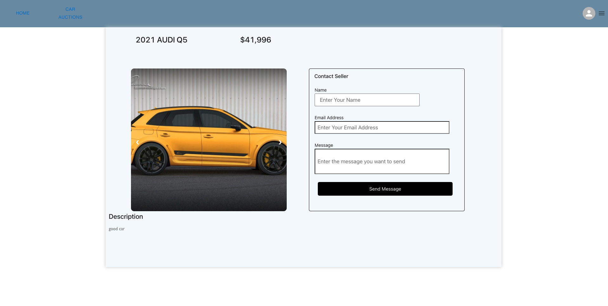
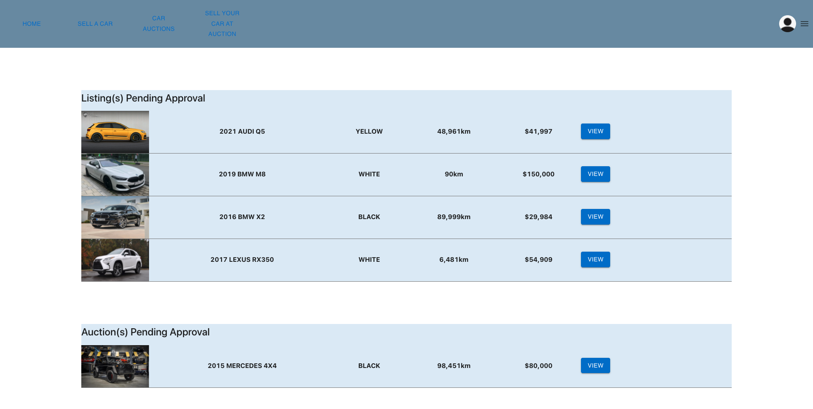
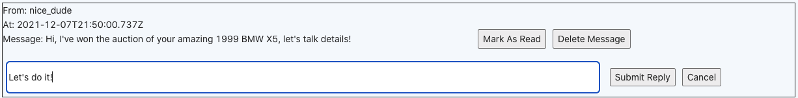

# Team37 - Car Trader
**This is Phase 2 of team 37's Car Trader web app for CSC309.
Main Deployed Page:**
<br/>
**https://the-car-trader.herokuapp.com/**

## Home Page
Once the page is loaded, you will be greeted with our home page.

### Greeting Message


### User Home Page View


You can see the navigation bar at the top of the screen, allowing you to go to our home page (normal car listing), new car listing creation page, auction car listing, new auction creation page, and the SignIn/SignUp popup.

In the middle of the home page is our search bar, allowing you to input specifications to search for. Instructions of how to use the search bar feature will be shown in the later 'Search Bar' section

The bottom part is our featured listing. Currently there is no listing created so the list is empty.

### Visitor Home Page View


Note that if you do not log in into an account, only the home page tab would be displayed and you can only view the home page. You can only see post listings, but not the detailed post, neither can you create any new posting. This servers the purpose of security. Users can only view a specific post and create posts when logged in.

### Admin Home Page View


Also Note that if you log in as admin, only listing auction tab will appear on the navigation bar to mitigate the situations where send self-approval for the listing post.

### User My Posting Page View


By clicking the "My posting" button of the profile dropdown menu, users can go to view and managed their postings


All the approved and unapproved normal postings, as well as the approved and unapproved auction postings that the user created can be shown on this page.

The users can either view the individual post, or delete one. The deleted post will be removed from the database as well.

## Sign In
### Sign In Page View


When you click the Sign In/Up button in the navigation bar, a popup window will show up in the middle of the screen, allowing user to input username and password.

Currently you can use the following to login credentials as regular user
```
username: user
password: user
```
or use the following to login as admin
```
username: admin
password: admin
```
Upon successful login, the popup window will close automatically after a short period of time.

## Sign Up

### Sign Up Page View


Clicking **CREATE AN ACCOUNT** in previous login page will lead you to account creation popup, where you can input your information.
After entering all the required information and click the **Sign up and log in** button, you will create a new account and also signed in to our application.

Note: validations are enabled in the fields **(email, postal code)** and all fields should have a length of at least **4** , normal users cannot create any admin accounts for security purposes.


## Viewing Car Posting
By clicking the **View** button on the right side of the listings, you can enter the viewing page of a particular
car that you're interested in.



In this page you can scroll through all pictures posted by the seller for this car, including a short description
written by the seller about the car. If a buyer is interested, he/she can send a inquiry to the seller. When the buyer sends a message to the seller, 
a message will be sent to the inbox of the seller. The seller can see the message and reply a message (will emphasis more on the 'Messages' section).


## Creating Car Posting
Users can create new car posting by clicking the **Sell A Car** button in the navigation bar.


Users can input relevant information about their car and upload pictures of their car. By clicking submit, the new post will be added to a list of unapproved posts for admins to review and approve/decline. After successfully create the post, a pop up window will be there to inform the users about that. (Please see below)


**P.S.**
The above figure shows the posting page if an user wants to sell a car. In the meantime, one of our project's extra feature is the auction feature. Hence, the figure below shows the posting page for posting an auction, similar fields are presented yet the user needs to select the starting and ending time for the bid as well as the bid's starting price.


Users must fill all the required fields, otherwise the user will be alerted.


Users can upload as many as pictures of their cars. If they do not provide any pictures, a default one will be added.


Below show a post created with no pictures uploaded, and the default picture is used:


## Admin Funciton Page
When logged in as admin, you will have an additional button in the drop down menu next to the profile picture.


Clicking **Admin Home** will take you to the admin home page where admin users can see new normal postings and auction postings that are currently
awaiting approval.



By clicking the view button, you will be redirected to post viewing page with admin pannel.


By clicking approve in the admin pannel, the pending posting will be removed form the unapproved posting list and 
added to the actual posting list, which you will be able to see in the **Home** page under **Featured Listing**.
Upon approve, the owner of the post will receive a message in their inbox saying their post has been approved.

By clicking decline in the admin pannel, the pending posting will be removed from the unapproved posting list and 
will not be added to the actual posting list. Admin can add a reason for declining the post and send to the user. Users can check the message
in their inbox and send any replies if applicable.

## User Profile
By clicking the Profile button in the profile drop down menu, you will be directed to the user profile page.

### Profile Page View


In here, user can change their various information about themselves. 

The existing user info will be pre-loaded in the entry fields for display purpose.
By clicking the "**Change Photo**" button, users can choose their profile photo from a various portrait photos we provided (currently only five of them).

By clicking the "**update**" button, the user info will be updated in the database and re-rendered in the profile page view.

**Note that all fields will need to be filled to successfully update the user profile.**

## Filter
Users can use the filter feature to filter the listings according to their preference. 

Below is the complete car listing (before any filter):


By entering the car make of "bmw" and click the search button(the magnifier icon), only BMW cars would be displayed in the listing. 


By entering the car model of "q5" and click the search buttonm, only model with Q5 would be displayed.


Same for color, by filtering color "yellow", only yellow cars would be displayed.


Users can also filter with a year range and a price range by entering the start/end year/price. Below is a demo of filter by year range of 2016 to 2020.


If the user is violating the year range (i.e. end year is small than start year), an alert popup with be displayed (same for price range)


Users can also filter by the maximum mileage of the car. See demo below


The filter feature supports any combinations of cross search. The users can enter from none to all of the search fields and the results will be display according to the filled field. Below is a demo of cross-filter for color "yellow" and maximum mileage of 60000:


By clicking the "Clear Filter" button next to the search button, all the fields will be cleared and the displayed listings will be the complete car listing without any filter.

Note that the inputs to the search fields are NOT case sensitive. That means, if users enters "bmw" or "BMW" or even "bMw", the results would be all the same.


## Messages
Messaging system through our webapp allows for communication between users.

### Sources of Messages
1. Buyers contacting seller through car listings.

If a message is sent successfully, you will see a confirmation message.


2. Admin approval/decline. Creator of a post (auction or regular listing) will receive a message when a decision is made by an admin on their post. A message for a declined post will also include the reson as to why it was declined.

3. Auction ending. When an auction ends, creator of that auction and all participating users of that auction will be notified. Creator of auction will receive message on who won the auction or that there is no participant. Participating users will receive message on whether they have won the auction or not.

4. Apart from the above sources, users can also receive messages from replies from others.

### User Inbox
Every user, upon registration will have an inbox being created for them, below is the different examples of messages, in the same order as metioned above.

1. Buyer showing interest. User nice_dude has sent a message to the creator of that listing, and this is in the post creator's inbox.


2. Admin approval/decline.


3. Auction Ending.
This auction had no participant, so the creator is notified that no one is here to buy the car. Sad.


This auction is won by user nice_dude, so the creator got a message from him saying that he's the winner of the auction (the message actually sent by admin but used nice_dude's information to indicate the winner).


User nice_dude is the winner of this auction, so he got a message from admin to inform him of this great news.


User nice_dude didn't win this auction, so he got a message form admin to inform him of this sad news.


4. Replying to messages.
Users can reply to messages that they've received from others. User can click the reply button and a input box will appear. User can choose to submit the message for sending or cancel the reply.

You will also get a nice message saying that reply was sent successfully.


5. Marking messages as read and filter based on read status.
Messages can also be marked as read, thus filtered by display option.
This is two messages being marked as read but display is set to all.


This is when display is set to only displaying read messages.


This is when display is set to only displaying unread messages.


6. Deleteing message. Users can click the delete button to delete messages that they want gone.

## Auction

1. Active auctions are displayed in the auction page. User can click view to see the details of the auction. Including the car that is being sold, the remaining price, and the current highestBid.

2. User can place bid by entering a number. Users are not allowed to bid on their own car or place a lower bid than the current highest bid. A message will be displayed indicating if the bid was successfully placed or not.


3. After the count down is finished, the Submit Bid button will become grey, any attempt to submit another bid will be rejected, the message will indicate that the auciton is now over.


## Reference
This section outlines all the external libraries the team used for phase 2 development

Material UI: https://mui.com \
Ant Design: https://ant.design/components/ \
react-carousel: https://www.npmjs.com/package/react-responsive-carousel \
react-checkmark: https://www.npmjs.com/package/react-checkmark \
react-number-format: https://www.npmjs.com/package/react-number-format \
react-router-dom: https://www.npmjs.com/package/react-router-dom
